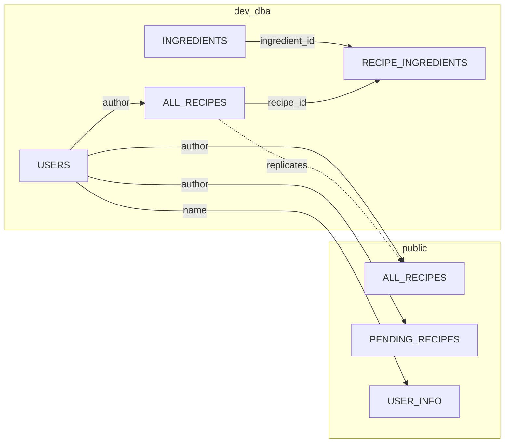

*This project has been created as part of the 42 curriculum by ncamobel, duamarqu, framador, dioalexa, lede-gui*

# Brunchio

Brunchio is the working name of this Transcendence project: a secure recipe-sharing web application built with a React frontend, an HTTPS API gateway, and two backend microservices backed by PostgreSQL and Redis.

## Description

The app lets users register, log in, complete 2FA, connect GitHub OAuth, edit their profile, upload avatars, manage friends, and browse or submit recipes for moderation. Public recipes and pending recipes are split into separate flows so the admin side can review submissions before they become visible to everyone.

The frontend is built with React, TypeScript, Vite, Material UI, and SSR support. The backend is split into an auth service, a recipes service, and an HTTPS API gateway. The whole stack is containerized and designed to run with a single command.

## Features

- Email/password authentication with JWT sessions.
- GitHub OAuth login.
- Two-factor authentication with TOTP.
- Profile management, public profiles, and avatar uploads.
- Friend requests and friend lists.
- Public recipes and pending recipe moderation.
- CSV recipe import support.
- HTTPS everywhere through the gateway.
- Redis-backed rate limiting.
- Privacy Policy and Terms of Service pages accessible from the footer.
- Responsive UI with Material UI components.
- Server-side rendering for the frontend.

## Instructions

### Prerequisites

- Docker and Docker Compose.
- Node.js 22+ if you want local frontend development outside Docker.
- A root-level `.env` file.

### Environment Setup

1. Copy `.env.example` to `.env`.
2. Replace the placeholder values with your real PostgreSQL, JWT, GitHub OAuth, and host settings.
3. Generate the local certificates with `./gen_certs.sh` if they are missing.

### Run The Project

1. Start the full stack from the repository root with `make`.
2. Stop everything with `make down`.
3. Restart the stack with `make restart`.
4. Run only the backend services with `make -C backend docker_build docker_up`.
5. Stop only the backend services with `make -C backend docker_down`.
6. View backend logs with `make -C backend docker_logs`.

### Main URLs

- Frontend: `https://localhost:1025`
- API gateway: `https://localhost:3443`
- Public API: `https://localhost/api`
- Privacy Policy: `https://localhost/privacy-policy`
- Terms of Service: `https://localhost/terms-of-service`
- PgAdmin: `https://localhost:5050`

### Local Frontend Development

- Run the frontend only with `cd frontend && npm install && npm run dev:ssr`.
- The root Makefile also includes a combined development target: `make dev-frontend-local`.

## Team Information

Ncampbel - Product Owner, Project Manager, Developer
Framador - Project Manager, Technical Lead, Developer
Duamarqu - Technical Lead, Developer
Dioalexa - Project Manager, Developer
Lede-gui - Architect, Developer

### Role Breakdown

Product Owner

ncampbell — defines the product vision, maintains the product backlog, prioritizes features, validates completed work, and communicates with stakeholders.

Project Manager / Scrum Master

ncampbell, framador, dioalexa — collectively responsible for organizing meetings, tracking progress and deadlines, ensuring team communication, and managing risks and blockers.

Technical Lead / Architect

framador, duamarqu, lede-gui — oversee technical decisions and architecture, define the technology stack, ensure code quality and best practices, and review critical code changes.

Developers

All team members — implement assigned features, participate in code reviews, test their own implementations, and document their work.

## Project Management

To stay organised and aligned throughout the project, we relied on a combination of structured planning and constant communication.

- Planning method: Regular group meetings and calls, supplemented by ongoing discussions over WhatsApp.
- Task tracking tool: We used Linear to manage and track tasks, keeping everyone aware of progress and priorities.
- Communication channel: Day-to-day communication happened primarily over WhatsApp, allowing for quick updates and decisions.
- Code review practice: We enforced a strict branching policy — direct pushes to main were not allowed. Every pull request required approval from at least one other team member, with review coverage across all changed files.

## Technical Stack

- Frontend: React 19, TypeScript, Vite, React Router, Material UI, GSAP.
- Backend: Express 5, JWT, bcrypt, Multer, Speakeasy, Redis, Axios, node-postgres.
- Database: PostgreSQL.
- Infra: Docker, Docker Compose, HTTPS certificates, API gateway, Prometheus metrics, Grafana and ELK-related monitoring services.

## API Overview

### Authentication

Protected routes require this header:

```https
Authorization: Bearer <jwt_token>
```

The auth middleware rejects missing, invalid, expired, or temporary tokens and requires a stable user identity in the payload.

### Main Auth Routes

- `POST /register`
- `POST /login`
- `POST /login/2fa`
- `GET /auth`
- `GET /auth/github`
- `GET /auth/github/callback`

### Profile Routes

- `PUT /profile`
- `PUT /profile/password`
- `POST /profile/avatar`
- `DELETE /profile/avatar`
- `POST /profile/2fa/setup`
- `POST /profile/2fa/verify`
- `POST /profile/2fa/disable`

### Friends Routes

- `GET /profile/friends`
- `POST /profile/friends`
- `GET /profile/friends/requests`
- `POST /profile/friends/requests/accept`
- `DELETE /profile/friends/requests`
- `DELETE /profile/friends`

### Recipes Routes

- `GET /recipes`
- `GET /recipes/:name`
- `POST /recipes`
- `PUT /recipes/:name`
- `DELETE /recipes/:name`
- `GET /pending/recipes`
- `POST /pending/recipes`
- `GET /pending/recipes/:name`
- `PUT /pending/recipes/:name`
- `DELETE /pending/recipes/:name`

Legacy view aliases are also available for the frontend routes:

- `/RecipeListView`
- `/RecipeView/:name`
- `/pending/RecipeListView`
- `/pending/RecipeView/:name`

## Database Schema



The schema is organized around the main application flows:

- `dev_dba.users`: user authentication, profile data, roles, avatar, 2FA state, and friend/request lists.
- `dev_dba.ingredients`: ingredient catalog data used by recipe import and moderation flows.
- `public.all_recipes`: approved recipes visible to all users.
- `public.pending_recipes`: user-submitted recipes waiting for review.

The relationships are centered on user ownership and moderation: users submit pending recipes, admins approve or reject them, and approved entries are promoted into the public recipe table.

# Modules

## Overview

| Category | Count | Points |
|---|---|---|
| Major Modules | 7 | 14 |
| Minor Modules | 9 | 9 |
| **Total** | **16** | **23** |

> The first 14 points (all Major modules) fulfill the mandatory requirement. All 9 Minor modules qualify as bonus, as the mandatory threshold is fully covered by Major modules alone.

---

## Major Modules (2 pts each)

| # | Module | Team Member(s) | Points |
|---|---|---|---|
| M1 | Framework — React/TS + Express | ncampbell, duamarqu, framador | 2 |
| M2 | Public API (secured, rate-limited, 5+ endpoints) | duamarqu | 2 |
| M3 | Standard User Management & Authentication | framador | 2 |
| M4 | Advanced Permissions System | lede-gui, ncampbell | 2 |
| M5 | Log Management Infrastructure (ELK Stack) | dioalexa | 2 |
| M6 | Monitoring System (Prometheus + Grafana) | dioalexa | 2 |
| M7 | Backend as Microservices | duamarqu, framador | 2 |

**Major subtotal: 14 pts** ✅ — Mandatory threshold met

---

## Minor Modules — Bonus (1 pt each)

| # | Module | Team Member(s) | Points |
|---|---|---|---|
| m1 | ORM for Database | lede-gui | 1 |
| m2 | Server-Side Rendering (SSR) | framador | 1 |
| m3 | Custom Design System (10+ reusable components) | ncampbell | 1 |
| m4 | Advanced Search (filters, sorting, pagination) | ncampbell, duamarqu | 1 |
| m5 | File Upload & Management System | framador | 1 |
| m6 | Cross-Browser Support | duamarqu, ncampbell | 1 |
| m7 | OAuth 2.0 Remote Authentication | framador | 1 |
| m8 | Data Export & Import | framador | 1 |
| m9 | Two-Factor Authentication (2FA) | framador | 1 |

**Minor subtotal: 9 pts** — All bonus-eligible

---

## Module Details

### M1 — Framework: React/TypeScript + Express
**Type:** Major | **Points:** 2 | **Team:** ncampbell, duamarqu, framador

**Justification:** Using established frameworks on both ends ensures maintainability, type safety, and a clear separation of concerns across the stack.

**Implementation:** The frontend was built with React and TypeScript, providing a strongly-typed component-based UI. The backend was built with Express.js, serving as the primary HTTP layer for the application's REST API.

---

### M2 — Public API
**Type:** Major | **Points:** 2 | **Team:** duamarqu

**Justification:** A well-documented public API enables third-party integrations and provides a clean, stable interface for interacting with application data.

**Implementation:** A RESTful API was implemented with Express, secured via API key authentication. Rate limiting was enforced using middleware. The API exposes 5+ endpoints.

---

### M3 — User Management & Authentication
**Type:** Major | **Points:** 2 | **Team:** framador

**Justification:** A secure and standard authentication system is fundamental to any multi-user application.

**Implementation:** Full user lifecycle management including registration, login, password hashing, session handling, and JWT-based authentication.

---

### M4 — Advanced Permissions System
**Type:** Major | **Points:** 2 | **Team:** lede-gui, ncampbell

**Justification:** Role-based access control (RBAC) ensures users can only access and modify resources they are authorised for.

**Implementation:** A permissions layer was built on top of the authentication system, defining roles and enforcing access rules both at the API level and within the frontend UI.

---

### M5 — Log Management Infrastructure (ELK Stack)
**Type:** Major | **Points:** 2 | **Team:** dioalexa

**Justification:** Centralised log management is essential for debugging, auditing, and observability in a microservices architecture.

**Implementation:** Elasticsearch, Logstash, and Kibana were deployed via Docker Compose. Application logs are shipped through Logstash, stored in Elasticsearch, and visualised in Kibana dashboards.

---

### M6 — Monitoring System (Prometheus + Grafana)
**Type:** Major | **Points:** 2 | **Team:** dioalexa

**Justification:** Real-time metrics and alerting are critical for maintaining service health and detecting issues proactively.

**Implementation:** Prometheus scrapes metrics from each microservice. Grafana connects to Prometheus as a data source and displays custom dashboards tracking latency, error rates, and resource usage.

---

### M7 — Backend as Microservices
**Type:** Major | **Points:** 2 | **Team:** duamarqu, framador

**Justification:** A microservices architecture improves scalability, fault isolation, and independent deployability of each service.

**Implementation:** The backend was split into independent services (e.g. auth, user, API gateway), each running in its own container and communicating via defined interfaces, orchestrated with Docker Compose.

---

### m1 — ORM for Database
**Type:** Minor | **Points:** 1 | **Team:** lede-gui

**Justification:** An ORM abstracts raw SQL, reduces boilerplate, and improves type safety when interacting with the database.

**Implementation:** An ORM was integrated into the backend services, handling schema definition, migrations, and queries.

---

### m2 — Server-Side Rendering (SSR)
**Type:** Minor | **Points:** 1 | **Team:** framador

**Justification:** SSR improves initial page load performance.

**Implementation:** Key public-facing pages are rendered server-side, returning fully populated HTML to the client on first load.

---

### m3 — Custom Design System
**Type:** Minor | **Points:** 1 | **Team:** ncampbell

**Justification:** A consistent design system accelerates development and ensures visual coherence across the application.

**Implementation:** A component library was built from scratch with 10+ reusable components (buttons, inputs, modals, cards, etc.), a defined colour palette, typography scale, and iconography.

---

### m4 — Advanced Search
**Type:** Minor | **Points:** 1 | **Team:** ncampbell, duamarqu

**Justification:** Advanced search improves usability and discoverability of content within the application.

**Implementation:** Search functionality supports keyword queries, multiple filter criteria, sorting options, and paginated results, implemented at both the API and UI levels.

---

### m5 — File Upload & Management
**Type:** Minor | **Points:** 1 | **Team:** framador

**Justification:** File handling is a common user need and adds practical value to the platform.

**Implementation:** Users can upload files via the UI. Files are stored and managed server-side, with metadata tracked in the database and access controlled via permissions.

---

### m6 — Cross-Browser Support
**Type:** Minor | **Points:** 1 | **Team:** duamarqu, ncampbell

**Justification:** Ensuring compatibility across major browsers widens the accessible user base.

**Implementation:** The frontend was tested and adjusted for compatibility across Chrome, Firefox, Safari, and Edge, addressing layout and API inconsistencies where needed.

---

### m7 — OAuth 2.0 Remote Authentication
**Type:** Minor | **Points:** 1 | **Team:** framador

**Justification:** OAuth 2.0 provides a familiar, secure, and frictionless login experience through trusted identity providers.

**Implementation:** OAuth 2.0 login flows were integrated with at least one provider (e.g. Google, GitHub, or 42), handling token exchange and account linking.

---

### m8 — Data Export & Import
**Type:** Minor | **Points:** 1 | **Team:** framador

**Justification:** Export and import capabilities give users control over their data and enable interoperability.

**Implementation:** Users can export their data in structured formats (CSV or JSON) and re-import it, with validation handled server-side.

---

### m9 — Two-Factor Authentication (2FA)
**Type:** Minor | **Points:** 1 | **Team:** framador

**Justification:** 2FA significantly strengthens account security by requiring a second verification step beyond the password.

**Implementation:** TOTP-based 2FA was implemented, allowing users to enrol via an authenticator app. Verification is required at login after password validation.

## Resources

- React documentation: https://react.dev/
- Vite documentation: https://vite.dev/
- Express documentation: https://expressjs.com/
- Material UI documentation: https://mui.com/
- PostgreSQL documentation: https://www.postgresql.org/docs/
- Docker documentation: https://docs.docker.com/
- JSON Web Token introduction: https://jwt.io/introduction
- GitHub OAuth documentation: https://docs.github.com/apps/oauth-apps
- TOTP / 2FA reference: https://github.com/speakeasyjs/speakeasy

### AI Usage

AI was used to reorganize and proofread this README, align it with the project rules, and format the setup and API sections from the repository content. The concrete stack, routes, and run commands were verified against the codebase before writing.
