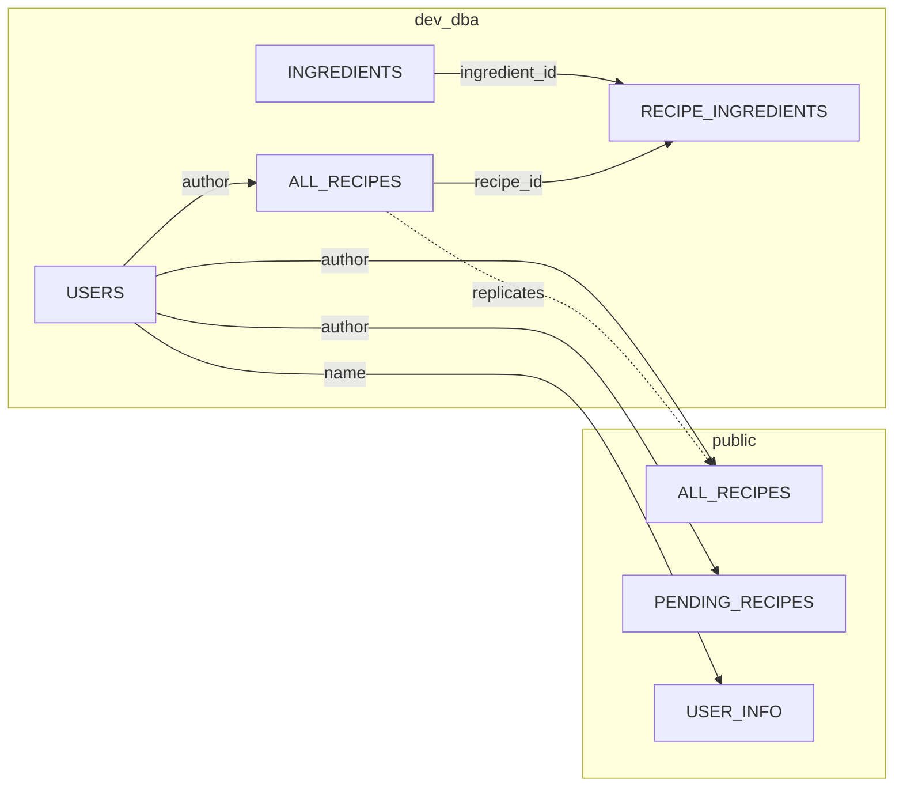

```mermaid
flowchart LR
  subgraph dev_dba["dev_dba"]
    direction TB
    dev_users["USERS"]
    dev_ingredients["INGREDIENTS"]
    dev_recipe_ingredients["RECIPE_INGREDIENTS"]
    dev_all_recipes["ALL_RECIPES"]
  end

  subgraph public_schema["public"]
    direction TB
    pub_all_recipes["ALL_RECIPES"]
    pub_pending_recipes["PENDING_RECIPES"]
    pub_user_info["USER_INFO"]
  end

  dev_users -->|author| dev_all_recipes
  dev_users -->|author| pub_pending_recipes
  dev_users -->|name| pub_user_info
  dev_users -->|author| pub_all_recipes
  dev_ingredients -->|ingredient_id| dev_recipe_ingredients
  dev_all_recipes -->|recipe_id| dev_recipe_ingredients
  dev_all_recipes -.->|replicates| pub_all_recipes
```